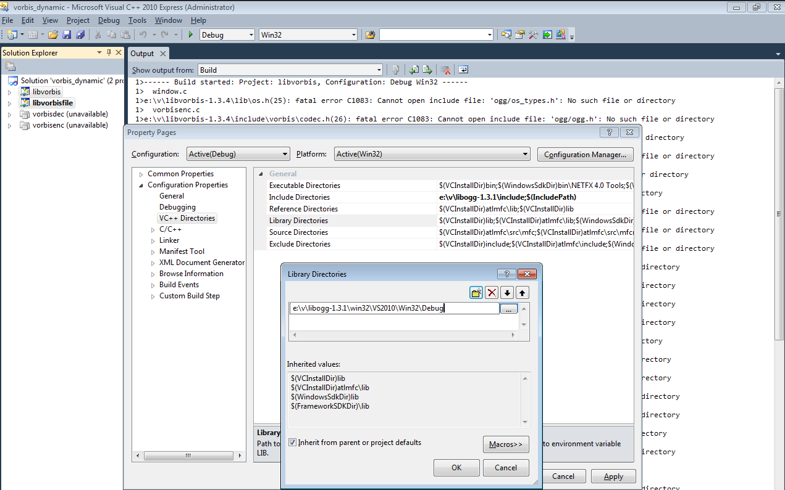
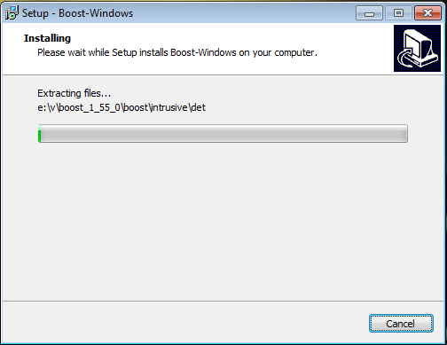
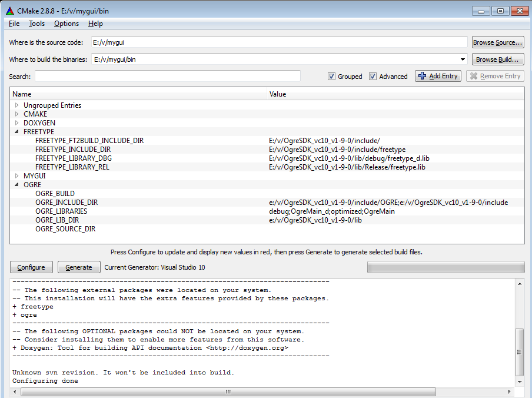
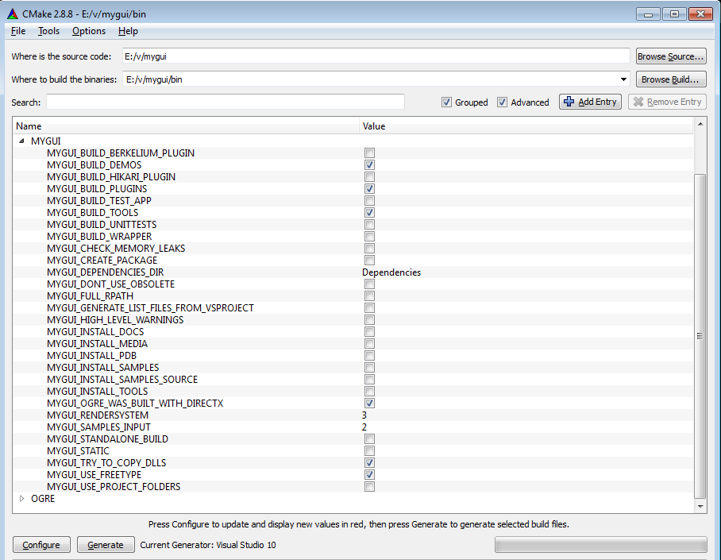
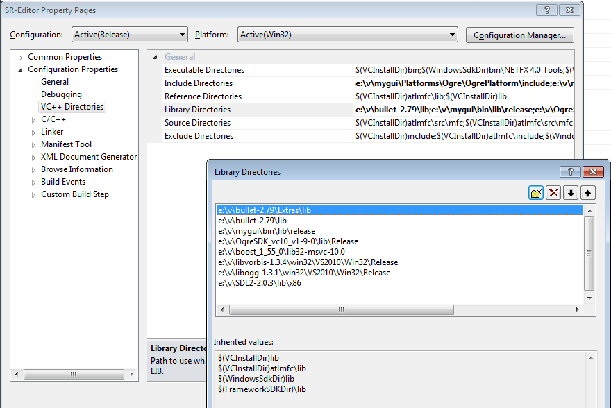
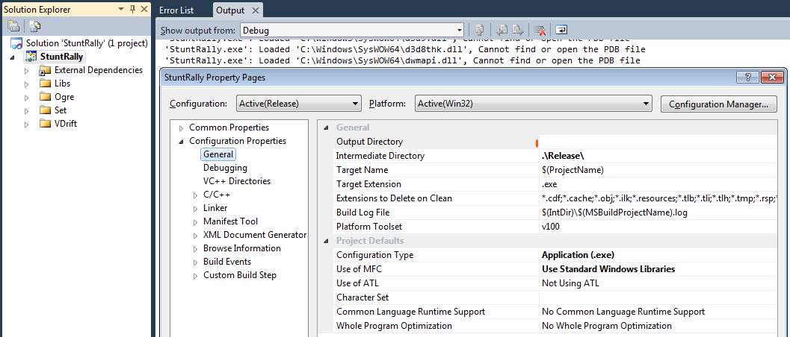
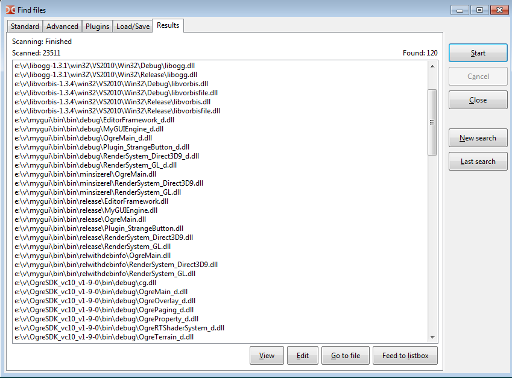
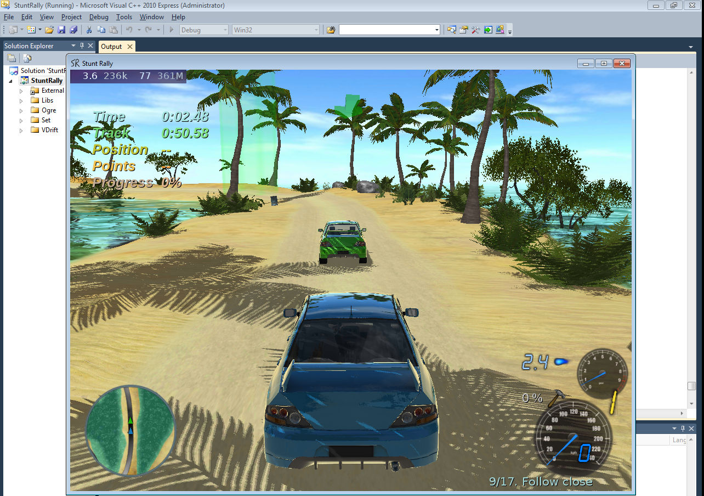

OLD Walkthrough to Compiling on Windows using Visual Studio 2010 Express.

NOTE: some parts are very outdated. But the approach is the same.

  
# Warning

This is a very old prebuild set of dependencies done with VS 2010
Express, **not usable now** (doesn't have OpenALsoft).

## Intro

The pre-built dependencies have been built using Visual Studio 2010
Express (is with SP1),  
and can work **only** for that version.

It is an archive with all compiled libraries needed to build SR.

> Simply a result of all, that has been done here below (in the
> compiling dependencies, nightmare section).  
> The minimal version of it, that should be enough, to unpack  
> and let building SR using the same VS (both Debug and Release
> possible).

## How to use

I will be referring here to paragraphs from below, since they are
already described there.

Firstly you need to install VS 2010 Express, [read
here](compilevs#visual_studio_c_2010_express).

Then download, the archive (`SR_deps_VS10exp.7z`) from
[here](http://sourceforge.net/projects/stuntrally/files/2.3/SR_deps_VS10exp.7z/download).

To unpack it, use [7-zip](http://www.7-zip.org/download.html) or any
decent File Commander that can.

Fastest way would be to unpack in `e:\v`, but you may not have `e:`,  
it is also possible to use it from other dir.

> *The archive itself has only dependency headers, their built libs, and
> .dll files in `stuntrally\proj`.  
> Also in `proj` there are build exe's (could be tested after you clone
> repos).  
> And lastly I included all from mygui/bin/bin/release, but would need
> MyGui data to start it.*

*No dependencies are needed, all are there (Boost, Bullet, Ogg, Vorbis,
MyGui, Ogre, SDL2).*

Next, you need to download (clone) the SR repositories, read [Get
Sources](compilevs#get_sources).  
*If clone won't work when it sees already the stuntrally dir which came
from archive just rename it.*  
Clone both stuntrally and tracks, `tracks` dir should be inside
`stuntrally\data`.  
Copy contents from archive's `stuntrally\proj`, to your
`stuntrally\proj` dir, the one you got from Git repo.  

> Now, if you don't use `e:\v` you need to replace all occurrences of
> that to your path.  

I recommend just taking a text editor and using *replace all* in files
StuntRally.vcproj and SR_Editor.vcproj.  
Is really the fastest way. Note: in vcprojs from repo it is `c:\v`.  
Note: the archive's vcx projects (with 1 in name) are outdated (not
having new cpp,h files etc.)  
Use the original VS 2008 files from repo (without 1 in name), read
[Projects](compilevs#projects) on how to setup them.

Go inside `stuntrally\proj` and open solution StuntRally.sln or
SR_Editor.sln.

Since Output dir isn't saved in project, clear it, as shown here:
[Output dir](compilevs#output_dir).  
Build the project.  
Needed .dll files to run are already there so build should start.

**THE END**

  
----

# Compiling Dependencies

------------------------------------------------------------------------

  
## Warning

If you do build on Windows and already have experience with this you can
skip this paragraph.  
Also if you don't like my comments or want to do this really fast,
*avoid text in italic*.  
\> *Especially formatted like this.*

  
This page provides a detailed description that could guide you through
the *nightmare* process of building on
[Windows](http://en.windows7sins.org/).

It is considered difficult and tedious, *annoying and stupid too*.

> *If you have never build any medium size, Linux projects and libraries
> on Windows, you should probably leave this page now.  
> Instead see [building on Ubuntu](compile).*

> *Seriously, I believe it is easier and quicker to install Ubuntu and
> build SR there. If you just want to build SR for fun, and you aren't
> too old to switch to a better OS. You could learn a new OS by the way
> and save yourself this nightmare.*

I only recommend reading this page if you e.g. want to learn how to deal
with the *idiotic* process of building something from sources on
Windows, with many dependencies. *Or if you build on Linux and want to
have a good laugh.*

Taking a week of holiday will be useful to complete this (or 2 days if
you did this already few times).  
*Also needed: a metric f&#\*kton of patience. Still, it is said that
Chuck Norris has built SR within 3 hours.*

Lastly, it is likely that you will have errors / issues, not mentioned
here,  
I recommend just putting them in
[stackoverflow](http://www.stackoverflow.com) or
[google](http://www.google.com) search.

  
## Introduction

Stunt Rally and SR Editor are 32-bit applications. *Don't even try
building with 64-bit compilers.*

I've built on Windows 7 64-bit, should work on 10 too.  
This page shows how to do it with VS 2010 Express. But the process is
similar in any newer version.  

------------------------------------------------------------------------

  
## Software Requirements

### Visual Studio

Any version should work. I didn't test myself though.

### Client for Git

To download the SR sources from repository you can get the client
[here](http://git-scm.com/downloads),  
which comes with a simple GUI and integrates with the Windows File
Explorer.  
*That should do the task, but you can also use
[TortoiseGit](http://code.google.com/p/tortoisegit/wiki/Download) or
[GitExtensions](https://github.com/gitextensions/gitextensions/releases),
it's up to you.*  
*If you really don't want to quickly update it later, you can download
an archive [here](https://github.com/stuntrally/stuntrally/tags) and
tracks [here](https://github.com/stuntrally/tracks/tags).*

### CMake

We need CMake to create the project and solution files for `MyGui`
library (also can be used for few other).  
Download from <http://www.cmake.org/>

> CMake is the best approach, since it is a layer above project files,
> it can be used to generate them for various IDEs.  
> It is used to build SR on Linux, and also could be used for SR
> projects, but currently that is broken.  
> When having trouble with paths, I recommend to add/modify them in
> CMake, not in Visual Studio.  
> Every time you use CMake your edits to vs projects are destroyed.  
> So Keep in mind if you do alter something in vs proj, don't use CMake
> after (or make a copy and merge/edit vcproj by hand).  
> Also CMake Gui is much more convenient (can be all done with keyboard)
> than VS stupid dialogs *(that remember the times of '95 and are
> resizable only since 2013 but at the cost of broken colors).*

------------------------------------------------------------------------

  
## Dependencies

Since I document here the quickest way possible,  
we will use pre-built packages (archives) for Boost, SDL, and Ogre (with
Ogre dependencies),  
rest has to be build from sources.

> *I personally always build everything from sources (lately except
> boost), since this is the only way to have full debug (in dependencies
> too), and is much safer to release. But that is the slowest way of
> all.*

> Note: SR needs specific version of Bullet library.  
> We will also use Boost 1.55 (this version is in Ogre 1.9 SDK, so to
> minimize possible complications and damage).  
> Otherwise newer versions can be used, but aren't needed.  
> *If you build everything from sources and like to live dangerously,
> you can try latest development versions.*  

I recommend to install/unpack all dependencies to a common folder.  
On this wiki and its images it will appear as `e:\v`. *(Why? because
it's much faster when you have to input it 50 times by hand.)*  
  
Now, download those by clicking on all Links.  
If the Download Link doesn't work use Downloads and pick version, if
even that is broken visit Website and find downloads.

| **Library** | Version used | Website                               | Downloads                                                                 | **Download Link**                                                                                                       |
|-------------|--------------|---------------------------------------|---------------------------------------------------------------------------|-------------------------------------------------------------------------------------------------------------------------|
| Ogre        | 1.9\*        | <http://www.ogre3d.org>               | [Downloads](http://www.ogre3d.org/download/sdk)                           | [Link](http://sourceforge.net/projects/ogre/files/ogre/1.9/1.9/OgreSDK_vc10_v1-9-0.exe/download)                        |
| Bullet      | 2.79\*       | <http://bulletphysics.org>            | [Downloads](https://code.google.com/p/bullet/downloads/list)              | [Link](http://code.google.com/p/bullet/downloads/detail?name=bullet-2.79-rev2440.zip&can=4&q======)                     |
| MyGui       | 3.2          | <http://mygui.info>                   | [Downloads](http://www.sourceforge.net/p/my-gui/code/HEAD/tree/)          | [Link](http://sourceforge.net/p/my-gui/code/HEAD/tarball)                                                               |
| SDL2        | 2.0.3        | <http://www.libsdl.org>               | [Downloads](http://www.libsdl.org/download-2.0.php)                       | [Link](http://www.libsdl.org/release/SDL2-devel-2.0.3-VC.zip)                                                           |
| Boost       | 1.55\*       | <http://www.boost.org>                | [Downloads](https://sourceforge.net/projects/boost/files/boost-binaries/) | [Link](http://sourceforge.net/projects/boost/files/boost-binaries/1.55.0-build2/boost_1_55_0-msvc-10.0-32.exe/download) |
| Enet        | 1.3.12       | <http://enet.bespin.org>              | [Downloads](http://enet.bespin.org/SourceDistro.html)                     | [Link](http://enet.bespin.org/download/enet-1.3.12.tar.gz)                                                              |
| Ogg         | 1.3.1        | <http://xiph.org>                     | [Downloads](http://xiph.org/downloads/)                                   | [Link](http://downloads.xiph.org/releases/ogg/libogg-1.3.1.zip)                                                         |
| Vorbis      | 1.3.4        | <http://xiph.org>                     | [Downloads](http://xiph.org/downloads/)                                   | [Link](http://downloads.xiph.org/releases/vorbis/libvorbis-1.3.4.zip)                                                   |
| OpenAL Soft | 1.13         | <https://github.com/kcat/openal-soft> | [tags](https://github.com/kcat/openal-soft/tags)                          |                                                                                                                         |

  
On this screen you can see them all unpacked in `e:\v`, the downloads
are on right in `_Install`, stuntrally dir will come later.

*Game needs all, editor only uses Ogre, Bullet, MyGui, SDL2, Boost, it's
easier to build editor. Enet is not needed in latest version.*

  
## Build Runtime Mode

Basically we only need Debug and Relase.  

> *So don't bother setting up other versions when building
> dependencies.  
> If you're feeling lucky you can try even only Release.  
> Much later the RelWithDbgInfo config can be useful, if you test a
> lot.*

> *Debug is extremely slow (like 30 fps on empty map), but it will let
> you use breakpoints, step code, see variable values, call stack,
> etc.  
> Relase is the fastest, but if it crashes you usually don't know where
> or what caused it, only output to .log can help here.  
> RelWithDbgInfo is between, it is a bit slower than Release but you can
> use breakpoints, step code, and see call stack, e.g. what caused a
> crash.*

All libraries **MUST** be build using Runtime set as **Multi-threaded
Debug DLL (/MDd)** in Debug Configuration,  
and **Multi-threaded DLL (/MD)** for Release configuration.  
It is very crucial to check every project in everything you will build
to have those set so.  
This is wrong in Bullet, others seem to have it set properly.  

> *If you don't you might be cursing a lot when seeing 100s of weird
> linker errors out of nowhere.  
> And is is quite tricky to find out which .lib caused it, if you didn't
> check. See e.g.
> [here](http://stackoverflow.com/questions/604484/linker-errors-between-multiple-projects-in-visual-c).*

  
### Ogg

Let's start with something simple.  
Unpack libogg-1.3.1.zip to your dev folder (here e:\\v) do the same with
libvorbis-1.3.4.zip.  
Go inside `e:\v\libogg-1.3.1\win32\VS2010` and open
libogg_dynamic.sln.  
Build should be easy, build both Debug and Release.

When finished you should see similar Output (I use it as Tabbed
window).  
It also shows where the generated .lib and .dll are, we need to know
those paths to set them later in SR projects.  
Close libogg VS now, we don't need it.

### Vorbis

Now go into `e:\v\libvorbis-1.3.4\win32\VS2010` and open
vorbis_dynamic.sln.  
In Solution explorer, select both projects vorbisdec and vorbisenc,
right click and Unload project. We don't need those and setting up takes
time.

Then, select libvorbis and libvorbisfile, right click and Properties (or
press R).  
*Since this is stupid building on Windows, and vorbis depends on ogg,
yet it has no idea where you put it or which version, you have to set
paths to it.*

In Properties, VC++ Directories, pick Include Directories, then click
the down arrow on right and then Edit...  
New dialog will show, as seen on next screen. Click the yellow button to
add new entry.  
Put there the path to your ogg headers, for me it was
`e:\v\libogg-1.3.1\include`.  
Do the same for Library Directories. It should show subdirs if you type
it.  
The path is `e:\v\libogg-1.3.1\win32\VS2010\Win32\Debug`.  

Now change the configuration to Release. And do the same.  
Include is the same but library is
`e:\v\libogg-1.3.1\win32\VS2010\Win32\Release`.

Now you should build without problems. Build both Debug and Release. You
will get 2 dll's (for vorbis and vorbisfile).

### OpenAL Soft

Download latest from [here](https://github.com/kcat/openal-soft/tags)
and unpack.

Use CMake to configure, then open sln in VS to build.

  
### Bullet

Unpack downloaded `bullet-2.79-rev2440.zip`.  
Go inside into `e:\v\bullet-2.79\msvc\vs2010` and open the solution
0BulletSolution.sln.  
You can skip building all Demos, select all with shift, right click,
Unload Project.  
We need only BulletCollision, BulletDynamics, BulletFileLoader,
BulletWorldImporter, LinearMath, you can unload rest.  
Crucial: select only those we need and set Runtime to Multi-threaded DLL
(/MD) in Release and Multi-threaded Debug DLL (/MDd) in Debug.  

### SDL

We downloaded already a build SDL2 archive, so just need to unpack it
(`SDL2-devel-2.0.3-VC.zip`).  
*If you want to build SDL from sources (not needed), download
[this](http://www.libsdl.org/release/SDL2-2.0.3.zip).  
Then extract in `e:\v` and go into `e:\v\SDL2-2.0.3\VisualC` dir and
open SDL_VS2010.sln.*

#### Enet

*Not needed.*  
Note: on current master version, the Stunt Rally game project has Enet
inside sources, so it's build with game, no need to build it outside.  
For older SR versions: Download the VS 2010 project files for Enet from
[here](http://vdrift-ogre.googlecode.com/files/enet_1.3.5_prj_files_vs2010.zip),
then open it and build project (in Debug and Release as always).  

------------------------------------------------------------------------

  
### Boost

*Welcome to the last, hardest trio Boost + Ogre + MyGui. Good luck.*

Start the downloaded `boost_1_55_0-msvc-10.0-32.exe` to install the
pre-built boost archives, set dir to `e:\v`.

Set environment variable BOOST_ROOT with main Boost path.

> *Side note: Boost consists of huge amount of really small
> (header/source) files and big ones (libs).  
> It will be like 4GB after install, later you can just delete most of
> it (still need like 1GB).  
> Because of our config we need only the files ending with
> `-mt-1_55.lib` and `-mt-gd-1_55.lib`.  
> I usually keep it in separate dir, so when I run a search in folders
> (or in file contents),  
> it doesn't spend an eternity inside boost dir.*

> If you want to build boost from sources (really not needed), download
> sources
> [here](http://sourceforge.net/projects/boost/files/boost/1.55.0/boost_1_55_0.7z/download)
> and  
> read how to build
> [here](http://www.boost.org/doc/libs/1_55_0/more/getting_started/windows.html#simplified-build-from-source)
> (just 2 commands in visual studio command prompt, but might take
> several minutes).

  
### Ogre

Start the downloaded `OgreSDK_vc10_v1-9-0.exe`.  
This will install Ogre build, it already includes debug and release lib
files *(also a piece of boost, and what not :-) ).*  
For reference you can read [Ogre
Wiki](http://www.ogre3d.org/tikiwiki/tiki-index.php?page=Installing+the+Ogre+SDK).  
You'll need to install also DirectX SDK June 2010 (Runtime/redist),
[link
here](http://www.microsoft.com/en-au/download/details.aspx?id=8109).  
Extract that and start DXSETUP.exe.  
*(you can delete other date files leaving just `Jun2010_*.cab` and the
short name files starting with d)*.

Now its time to set the environment variables (paths) that will be
needed when building MyGui.  
Start cmd.exe as an Administrator and use the setx command like below.  
*This way, surprisingly you don't even have to restart Windows after
that.  
If you change those for CMake, just close CMake and start again,  
it will remember your setup and last path, and will have the env. vars
changed.*

  
#### NOT needed, Optional, Building Ogre

Building Ogre from sources is very time consuming (and not needed to build SR).  
*Also takes like 6GB of disk space (mostly intermediate garbage).*  
But if you want to or you had troubles with Ogre SDK, then I recommend
this [Building Ogre
Wiki](http://www.ogre3d.org/tikiwiki/tiki-index.php?page=Building+Ogre)
on how to do it.  
*My short guide:*  
You need to install full DirectX SDK June 2010 (samples not needed, but
still 572MB to download), link
[here](http://www.microsoft.com/en-us/download/confirmation.aspx?id=6812).  
Install
[TortoiseHg](http://bitbucket.org/tortoisehg/files/downloads/tortoisehg-2.11.2-hg-2.9.2-x64.msi)
to get the sources.  
Clone these 2 repositories:  
<https://bitbucket.org/cabalistic/ogredeps> - Ogre Dependencies - into
e:\\v\\ogre\\Dependencies  
<https://bitbucket.org/sinbad/ogre/> - Ogre sources - into e:\\v\\ogre  
Then use CMake for Ogre dependencies and build them.  
Set environment paths for BOOST_ROOT, OGRE_HOME, OGRE_DEPENDENCIES_DIR
*(surprisingly not needed if you have `Dependencies` dir inside Ogre
dir)*.  
After that use CMake for Ogre and build.  
Other links: [Ogre Mercurial
Wiki](http://www.ogre3d.org/developers/mercurial), [Ogre
Prerequisites](http://www.ogre3d.org/tikiwiki/tiki-index.php?page=Prerequisites)  
*And above all, sit straight and don't curse. Also give your hands a
rest, if you don't use an ergonomic keyboard or still use the layout
from year [1878](http://www.dvzine.org/zine/).*

  
### MyGui

> *Welcome to the last, worst and longest step of building
> dependencies.  
> Here there be monsters. Btw, say hi to CMake from me.  
> Luckily though, CMake is not that horrible if you use Ogre from SDK,
> it finds it.  
> But it doesn't find freetype and **always** some paths have to be set
> manually.*

Unpack MyGui (e.g. `my-gui-code-5298-trunk.zip`) to `e:\v\mygui`.  
Run CMake-Gui from start menu.  
Set the source path to your dir, and build dir to same path with `/bin`
at end. Like on on the next screen.  
Press Configure, and pick Visual Studio 10 for the generator.

The configuration will fail. Not finding freetype (and possibly Ogre).  
Read CMake errors to know what failed. In this Wiki's process only
freetype was missing.  
Set the checkboxes Grouped and Advanced.  
Input the 4 paths for freetype like seen here. *If Ogre wasn't found
also, then for it too.*  
*You can select and copy if they are similar, also move with up/down,
and when typing you'll get contents listed.  
This is much better to do here than in VS.*

Press Configure again. If there are no errors, you should get new
options for MyGui, they'll appear in red.  
Press Configure again, they will stop being red (means applied).  
I used such options for them as below.  

> Crucial are:  
> MYGUI_USE_FREETYPE - on *(otherwise you won't have any text)*,  
> MYGUI_RENDERSYSTEM - see hint for possible values, pick the one with
> Ogre  
> MYGUI_SAMPLES_INPUT - can be just Win32,  
>   
> Now, if you care only about speed, to build this for SR, consider
> only  
> MYGUI_BUILD_TOOLS - if on you'll get LayoutEditor which is used to
> edit Gui for SR.  
>   
> If you want to check out MyGui, check (on) - MYGUI_BUILD_DEMOS,
> MYGUI_BUILD_PLUGINS  
> and MYGUI_BUILD_UNITTESTS - those are actually more demos with new Gui
> controls (tree, spline etc).  
> MYGUI_DONT_USE_OBSOLETE - is not important now but I always set it on.

Set up the values and guess what..  
Press Configure again.

Lastly, to not wait forever to build (and every time to just see
errors),  
add the /MP switch *(that everyone seems to forget)* to CXX compiler
flags. *Don't do it in VS, it's wasting time.*

  
Now press Configure and then Generate.  
You should now have the .vcxproj and .sln files for VS.  
Go inside `e:\v\mygui\bin` and open MYGUI.sln.

Try to build it. Don't expect this to succeed though. It will fail.  
It spits out an error not finding boost, which is actually an Ogre
dependency now.  
See Error List (I also recommend showing the Project column, right click
on tab).  
*Output has always more info on errors, but if there are many, Error
List has a better/shorter view.*

To fix this, in Solution Explorer, select all projects, except the ones
with CAPITAL letters.  
Right click, then R (or Properties). In VC++ Directories (just like for
libvorbis),  
add paths to boost in Include and Library Directories as seen here:

Now it should build.  
*ATM I don't know any better way (i.e. how to fix this in CMake).*  
After the build you should have LayoutEditor.exe in
`e:\v\mygui\bin\bin\release`. You can try to run it.

------------------------------------------------------------------------

  
## Build Stunt Rally

### Get Sources

Depending on what you installed back in [this
paragraph](compilevs#client_for_git),  
you may have various options to clone from git.  
*They can have the `--depth=1` parameter not available, which would
result in 1GB more to download, see [in Wiki
here](compilevs#get_sources) for size info.*  
Whatever you do, keep in mind you need to have **tracks** dir inside
**stuntrally/data** dir.  
*Game should start if not, but what's the point if you can't drive
anywhere.*  
*Don't worry though, after a clone to bad place, you can just move the
whole directory or rename it, all will work.*

If you only installed Git-scm, you will have in start menu Git Bash
(console), and Git GUI (which apparently doesn't have the depth
parameter). Start Git Bash, navigate to our `e:\v` dir

    cd e:
    cd v

Then use these commands to get latest sources  
*Note: It's more than 800 MB to download, so the clone process will take
a while depending on your connection speed.*

    git clone --depth=1 git://github.com/stuntrally/stuntrally.git stuntrally
    cd stuntrally/data
    git clone --depth=1 git://github.com/stuntrally/tracks.git tracks

  
When using TortoiseGit, this is how to do the first command.  
After that you have to clone tracks inside data, so Directory will be
`e:\v\stuntrally\data\tracks`.

  
### Projects

SR comes with Visual Studio 2008 project and solution files inside
`proj` dir (`e:\v\stuntrally\proj`).  
Those can be opened with VS 2010 Express and later, conversion dialog
will pop up.

If you build with VS 2008, there is a known issue:  
\> error C2719: '\_Val': formal parameter with \_\_declspec(align('16'))
won't be aligned.

    To solve it, go to file list
    (most probably "c:\Program Files\Microsoft Visual Studio 9.0\VC\include\list")
    and change the line 609 from
        void resize(size_type _Newsize, _Ty _Val)
    to
        void resize(size_type _Newsize, const _Ty& _Val)
    and save, build.

Open StuntRally.sln for game (or SR_Editor.sln for editor).  
Projects can't be build yet. We need the correct paths to dependencies
(includes and libraries).  
Open Project Properties, VC++ Directories, and edit Include and Library
Directories.  
This has to be done for both projects (game and editor) in both
configurations (Debug and Relase).  
*Of course if you aren't sure it will work, just do it once to test
first.*  
I recommend just selecting the whole line and replacing it with one from
here.  
If you have other path than `e:\v`, copy this line and in some text
editor (or even in VS) do a *replace all* for `e:\v` to your path.

#### VC Directories

*This is same for both game and editor. Warning: horribly long lines.*

Include Directories, (same for both Debug and Release)

    e:\v\mygui\Platforms\Ogre\OgrePlatform\include;e:\v\mygui\MyGUIEngine\include;e:\v\OgreSDK_vc10_v1-9-0\include\OGRE\Plugins\ParticleFX;e:\v\OgreSDK_vc10_v1-9-0\include\OGRE\Overlay;e:\v\OgreSDK_vc10_v1-9-0\include\OGRE\Paging;e:\v\OgreSDK_vc10_v1-9-0\include\OGRE\Terrain;e:\v\OgreSDK_vc10_v1-9-0\include\OGRE;e:\v\boost_1_55_0;e:\v\libogg-1.3.1\include;e:\v\libvorbis-1.3.4\include;e:\v\SDL2-2.0.3\include;$(IncludePath)

Library Directories, Release

    e:\v\bullet-2.79\Extras\lib;e:\v\bullet-2.79\lib;e:\v\mygui\bin\lib\Release;e:\v\OgreSDK_vc10_v1-9-0\lib\Release;e:\v\boost_1_55_0\lib32-msvc-10.0;e:\v\libvorbis-1.3.4\win32\VS2010\Win32\Release;e:\v\libogg-1.3.1\win32\VS2010\Win32\Release;e:\v\SDL2-2.0.3\lib\x86;$(LibraryPath)

Library Directories, Debug

    e:\v\bullet-2.79\Extras\lib;e:\v\bullet-2.79\lib;e:\v\mygui\bin\lib\Debug;e:\v\OgreSDK_vc10_v1-9-0\lib\debug;e:\v\boost_1_55_0\lib32-msvc-10.0;e:\v\libvorbis-1.3.4\win32\VS2010\Win32\Debug;e:\v\libogg-1.3.1\win32\VS2010\Win32\Debug;e:\v\SDL2-2.0.3\lib\x86;$(LibraryPath)

#### Output dir

Last thing we need, is to set empty Output dir.  
Open Project properties and on General tab, select the Output Directory
and just delete it. *Need to do it for both projects and both
configurations.*

### Build

With the above settings and paths set, you should be able to build game
or editor finally.  
It will take a minute or two.  
So, if you don't see any errors and you got your new shiny exe (in
project dir), I can now say:

Congratulations! The nightmare is over.

*Still, depending on how you built all dependencies and if there were
any problems, it can happen that you'll need to rebuild them. So best is
to just keep all dirs untouched.*

  
----

### Run

The executable requires a number of dll files, when you first start it,
it will surely crash since none are there.  
So, gather all the .dll files that were build or installed *(all are in
e:\\v, in all lib's output release/debug dirs)*.  
*You can use Find Files (alt-F7 in Double Commander) with `*.dll` to
save you the manual search.*

And copy them into `e:\v\stuntrally\proj` dir *(same where executables
should appear)*.

*It should be noted that some (ogg,vorbis,SDL) have same names for Debug
and Release .dll and .lib output (this is wrong), so we use Release
only.*

The exact list is (those with `_d` are for debug):

    libogg.dll
    libvorbis.dll
    libvorbisfile.dll
    MyGUIEngine.dll
    MyGUIEngine_d.dll
    OgreMain.dll
    OgreMain_d.dll
    OgreOverlay.dll
    OgreOverlay_d.dll
    OgrePaging.dll
    OgrePaging_d.dll
    OgreTerrain.dll
    OgreTerrain_d.dll
    Plugin_ParticleFX.dll
    Plugin_ParticleFX_d.dll
    RenderSystem_Direct3D9.dll
    RenderSystem_Direct3D9_d.dll
    RenderSystem_GL.dll
    RenderSystem_GL_d.dll
    SDL2.dll

After that it should really start.  
If it doesn't check out [Running wiki page](Running), see Ogre.log, etc.

Have fun.

------------------------------------------------------------------------
